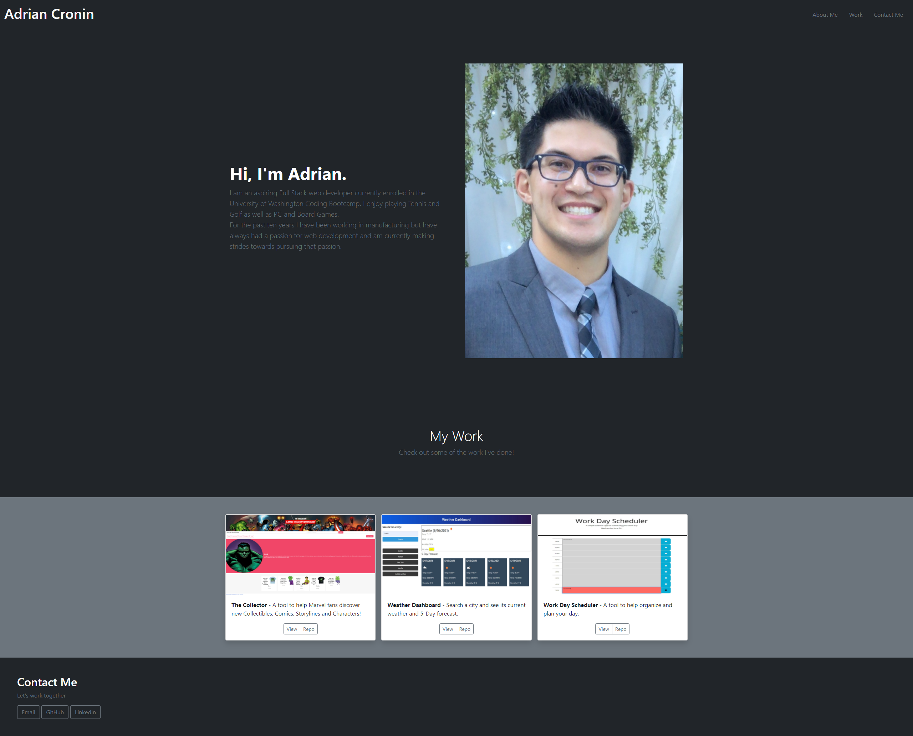

# AdrianCronin Github Portfolio

Deployed application: https://adriancronin.github.io/

## Description

My Github Portfolio
* The motivation for this project was to create a landing page where I can show potential employers projects and applications I have worked on or contributed to.
* I built this to hone my CSS skills and to get practice building styles from a provided mock-up and with a "mobile-first" mindset.
* I learned how to make a webpage that is responsive and functional for both small and large screen sizes.
* Note: Due to being a new developer, at this time all projects and applications shown are placeholders from the mock-up.

## Usage

Webpage as viewed on large screens:

Webpage as viewed on small screens:

